# 课程设计  体育赛事日志分析 实验报告

## 小组成员

- 组长：张丁楚（191220153）
- 组员：丁子千（191220023），张峻（191220160）

## 目录

[TOC]

## 各任务统一设计：Event类

在分别编写各个任务的具体代码之前，先设计了事件类`Event`，用于处理数据集中的每一行"事件"。

在构造函数中，传入一行文本内容，将该事件各个字段存入`HashMap`成员变量中

```java
public class Event {
    private HashMap<String, String> elements = new HashMap<String, String>();
    
    private String[] elementNames= {"Date","Quarter","SecLeft","AwayTeam","HomeTeam","PlayBy"
    ,"Shooter","ShotType","ShotOutcome","Assister","Blocker"
    ,"Rebounder","ReboundType"
    ,"FreeThrowShooter","FreeThrowOutcome"
    ,"Fouler","FoulType"
    ,"TurnoverPlayer","TurnoverType","TurnoverCauser"
    ,"EnterGame","LeaveGame"};

    public Event(Text line){
        String []elementValues = line.toString().split(",",elementNames.length); 
        for(int i=0;i<elementNames.length;i++){
            elements.put(elementNames[i],elementValues[i]);
        }
    }

    public String get(String name){ 
        return elements.get(name);
    }
}
```


## Task1：统计比赛结果

### 1.任务内容

统计每场比赛的比赛结果，针对每条日志计算得分情况后，按比赛计算总得分。

输出格式：日期，主队，主队比分，客队，客队比分。

### 2.思路

Map阶段：读取每一行事件内容(跳过数据集**第一行**)，若检测到得分事件，则输出。

- 输入<Key,Value>为：`<每一行的第一个字节索引，每一行文本内容>`


- 输出Key为：`<比赛日期，主队，客队>`，Value为：`<得分队伍，得到的分数>`

Reduce阶段：针对主队和客队，分别累加统计到的得分记录，最后按格式输出即可。

- 输入Key为：`<比赛日期，主队，客队>`，Value为：`<得分的队伍，得到的分数>`。


- 输出Key为：`<比赛日期>`，Value为：`<主队，主队得分，客队，客队得分>`。

### 3.部分输出结果展示

程序输出的结果如下：

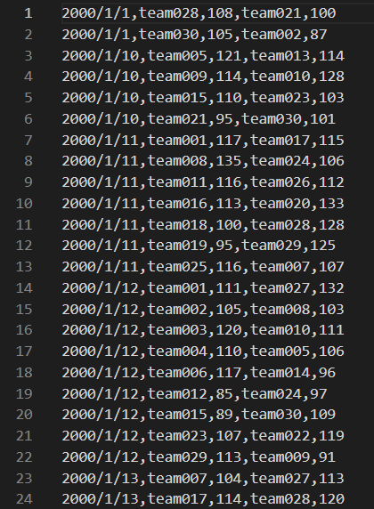

输出文件路径为：`/user/2021sg01/final/task1/part-r-00000`

### 4.WebUI执行记录

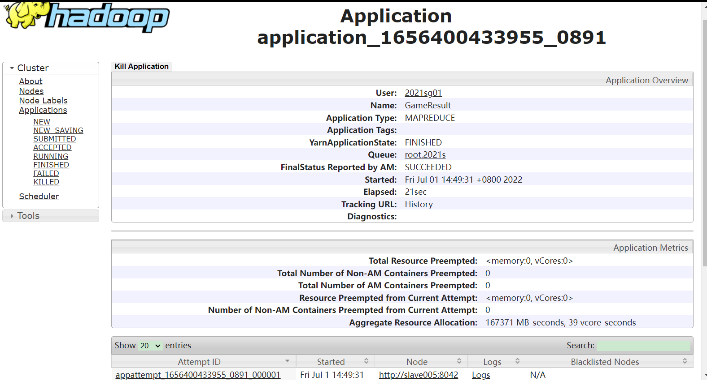


### 5.代码展示

#### Map阶段

```java
@Override
    protected void map(Object key, Text value, Context context) throws IOException, InterruptedException {
        
        if(key.toString().equals("0")){ //文件第一行,不处理
            return;
        }

        Event event=new Event(value);
        int point=0; //得分
        
        if(event.get("FreeThrowOutcome").equals("make")){ //罚球得分
            point=1;
        }
        else if(event.get("ShotOutcome").equals("make")){ //投篮得分
            point= (event.get("ShotType").equals("2-pt")) ? 2:3 ; //两分球得2分，三分球得三分
        }
        
        if(point==0) return; //没有得分

        //Emit
        String outputKey=String.join("#",event.get("Date"),event.get("HomeTeam"),event.get("AwayTeam"));
        String outputValue=String.join("#",event.get("PlayBy"),Integer.toString(point));
        context.write(new Text(outputKey),new Text(outputValue));
    }
```

#### Reduce阶段

```java
 @Override
    protected void reduce(Text key, Iterable<Text> values, Context context)  throws IOException, InterruptedException{
        String[] tokens=key.toString().split("#",3);
        String date=tokens[0],homeTeam=tokens[1],awayTeam=tokens[2];
        int homeScore=0,awayScore=0; //主队和客队得分
        String playBy;//得分队伍
        int score; //得分
        for(Text value:values){
            playBy=value.toString().split("#")[0];
            score=Integer.parseInt(value.toString().split("#")[1]);
            if(playBy.equals(homeTeam)){ //主队得分
                homeScore+=score;
            }
            else{//客队得分
                awayScore+=score;
            }
        }
        String outputKey=date;
        String outputValue=String.join(",",homeTeam,Integer.toString(homeScore),awayTeam,Integer.toString(awayScore));
        context.write(new Text(outputKey), new Text(outputValue));
    }
```

#### main函数部分

```java
public static void main(String[] args) throws Exception{
        //args: 命令行参数，分别为:输入数据集路径，输出路径
      
                Configuration conf=new Configuration();

                conf.set("mapred.textoutputformat.separator", ","); //设置输出中Key和Value的分隔符，不设置则默认为\t
                
                Job job = Job.getInstance(conf,"GameResult");

                job.setJarByClass(MyMain.class);
                job.setMapperClass(MyMapper.class);
                job.setReducerClass(MyReducer.class);

                job.setOutputKeyClass(Text.class);
                job.setOutputValueClass(Text.class);

                FileInputFormat.addInputPath(job, new Path(args[0]));//输入数据集的路径
                FileOutputFormat.setOutputPath(job,new Path(args[1]));//输出路径

                job.waitForCompletion(true); //执行MapReduce Job，等待结束
        
    }
```


## Task2：计算数据集中各项技术统计的前五名球员

### 1.任务内容

根据每条日志产生行为的制造队员进行统计，要求得到得分、篮板、助攻、抢断、盖帽最多的 5 名球员。

### 2.思路

使用两组Mapper-Reducer来完成本次任务。

第一组Mapper-Reducer：

- Mapper读入数据，并且输出对应事件的球员和具体事件`(Player, Event)`。对于得分，如果Shoot或者FreeThrow成功，输出对应的分数`(Player, Score)`。
- 在Reducer中，计算得到每个球员不同事件的数目并输出`(Player, <Event, Count>)`。

第二组Mapper-Reducer：

- Mapper读入数据，并且根据事件，输出对应事件的球员和计数`(<Event, Count>, Player)`。
- 为了让同一个Event的键值对进入同一个Reducer，需要自定义Partitioner；
- 为了利用MapReduce框架的Sort根据Count对传入Reducer的键值对进行排序，需要自定义Comparator。便于Comparator进行比较，自定义了class TypeScore作为Mapper输出的key的类型。这样，就可以避免在Reducer中进行排序而造成的内存开销过大的问题。
- 在Reducer中，将传入的当前Event得分前五的球员信息直接输出即可`(Event, <Player, Count>)`。

### 3.优化工作

按照普通算法，在第二组Mapeer-Reducer中，每个Event对应一个Reducer，在Reducer中根据Count从大到小进行排序，输出数量前五的选手信息。但是由于Reducer的这一步排序在内存中进行，当数据量较大时，可能发生内存泄漏。

因此，我们自定义Comparator，利用MapReduce框架的自动排序，对Mapper输出的键值对根据Count降序排列。为了便于Comparator的书写，我们自定义了class TypeScore作为Mapper输出的key的类型。这样，可以避免在Reducer中进行排序而引起的较大内存压力。

### 4.执行结果

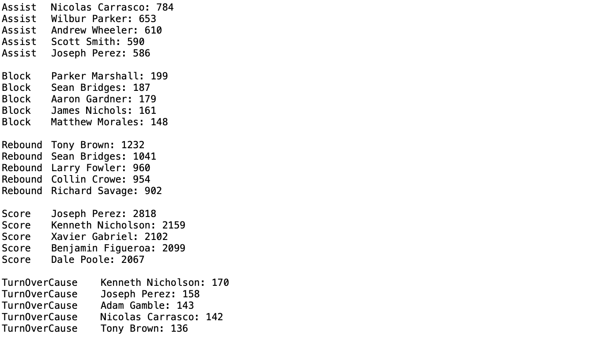

### 5.WebUI执行记录

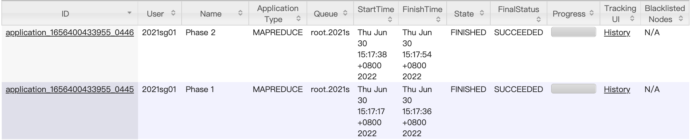

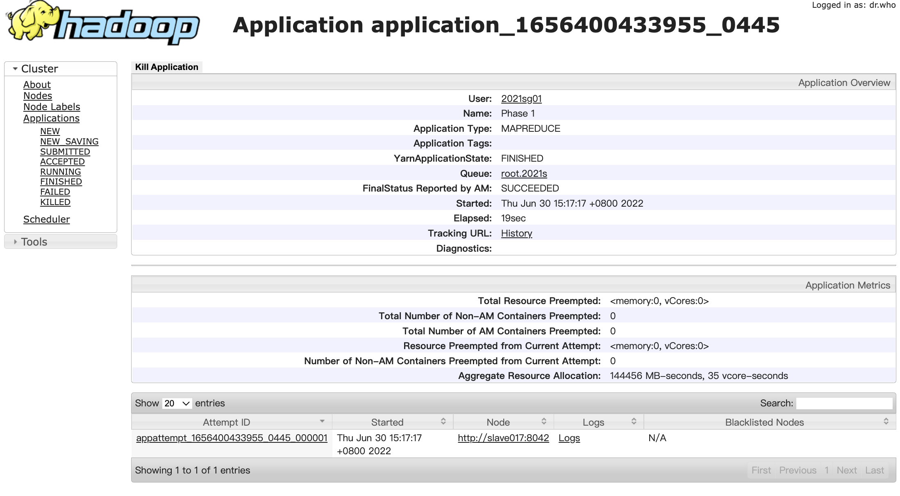


### 6.代码展示

#### 第一个map-reduce job：

```java
public class Mapper1 extends Mapper<Object, Text, Text, Text> {
    public void map(Object key, Text value, Context context) throws IOException, InterruptedException {
        StringTokenizer itr = new StringTokenizer(value.toString(), "\n");//读取行
        while (itr.hasMoreTokens()) {
            Event event = new Event(itr.nextToken());
            if (event.get("Assister").equals("Assister"))//表头
                continue;
            if (!event.get("Assister").equals("")) {
                context.write(new Text(event.get("Assister")), new Text("Assist"));
            }
            ......//emit Blocker, Rebounder and TurnoverCauser
            if (event.get("ShotOutcome").equals("make")) {//score
                String score = event.get("ShotType").split("-")[0];
                context.write(new Text(event.get("Shooter")), new Text(score));
            }
            if (event.get("FreeThrowOutcome").equals("make")) {//score
                context.write(new Text(event.get("FreeThrowShooter")), new Text("1"));
            }
        }
    }
}

public class Reducer1 extends Reducer<Text, Text, Text, Text> {
    public void reduce(Text key, Iterable<Text> values, Context context) throws IOException, InterruptedException {
        Iterator<Text> it = values.iterator();
        Text name = new Text(key);
        int Assist = 0, Block = 0, TurnOverCause = 0, Rebound = 0, Score = 0;
        for(;it.hasNext();) {
            String type = it.next().toString();
            if (type.equals("Assist"))
                Assist += 1;
            else if (type.equals("TurnOverCause")) 
                TurnOverCause += 1;
            else ......//calculate Block, Rebound and Score
        }
        context.write(name, new Text("Assist:" + Score));
        context.write(name, new Text("TurnOverCause:" + Rebound));
      	......//output Block, Rebound and Score
    }
}
```

#### 第二个Map-Reduce Job：

```java
public class TypeScore implements WritableComparable<TypeScore>{
    private String type;
    private int score;
    public TypeScore(String type, int score) {
          this.type = type;//the type of event
          this.score = score;//the count of event
      }
   	......//functions
}

public class Mapper2 extends Mapper<Object, Text, TypeScore, Text> {
    public void map(Object key, Text value, Context context) throws IOException, InterruptedException {
        StringTokenizer itr = new StringTokenizer(value.toString(), "\n");//读取行
        while (itr.hasMoreTokens()) {
          	......//get name, type and score
            if (type.equals("Assist"))
                context.write(new TypeScore("Assist", score), new Text(name));
            else if (type.equals("TurnOverCause"))
                context.write(new TypeScore("TurnOverCause", score), new Text(name));
            else ......//output Block, Rebound and Score
        }
    }
}

public class Reducer2 extends Reducer<TypeScore, Text, Text, Text> {
    Integer i = 0;
    String cur_type = new String();
    public void reduce(TypeScore key, Iterable<Text> values, Context context) throws IOException, InterruptedException {
        Iterator<Text> it = values.iterator();
        int score = key.getScore();
        String type = key.getType();
        if((cur_type.equals("")) || (!cur_type.equals(type))) {//this type finishes
            cur_type = type;
            i = 0;
        }
        for (; (it.hasNext()) && (i < 5); i++) {//output the top 5 players
            String name = it.next().toString();
            context.write(new Text(type), new Text(name + ": " + score));
        }
    }
}
```


## Task4：选出表现最好的五名球员

### 1.任务内容

设计合理的评价标准，评选出表现最好的5名球员。

### 2.思路

结合球员个人表现和球队战绩来评价：

- 球员表现：根据技术统计，计算高阶评价指标：**效率值Efficiency(EFF)**，来衡量球员的个人表现。
  - 效率值的计算公式为：`(得分 + 篮板 + 助攻 + 抢断 + 盖帽 − 错失的投篮 − 错失的罚球 - 失误) / 比赛场次`
- 球队战绩：统计球队的**胜率**。

结合球员表现和球队战绩后的**最终得分**：`Score=EFF + 胜率(%)*20`。

通过以上方式选出表现最好的五名球员，需要两个MapReduce Job：

1. 根据**原始数据集**和**任务一求得的每场比赛结果**，得到球员的效率值和球队胜率，计算得到球员的最终得分Score。
2. 利用MapReduce框架对球员的最终得分Score进行**全局排序**。

#### 第一个Job

由于需要**任务一求得的每场比赛结果**，因此使用**Distributed Cache**，存放该结果文件。

Map阶段：计算效率值的**分子**部分，根据每一条事件，输出相应球员在该事件上得到的效率值分数(负面事件的分数为负)。

- 输入<Key,Value>为：`<每一行的第一个字节索引，每一行文本内容>`

- 输出Key为：`<球员所属队伍，球员姓名>`，Value为：`<该事件得到的效率值分数>`

Reduce阶段：读入**Distributed Cache**中的战绩，计算该球员对应球队的**胜率**和**比赛场次数**(效率值的分母)；根据传入的Value列表，进行累加，计算得到效率值的分子。计算得到该球员的最终得分。

- 输入Key为：`<球员所属队伍，球员姓名>`，Value为：`[<该事件得到的效率值分数>]`
- 输出Key为：`<球员的最终得分>`，Value为：`<球员姓名---所属队伍>`

#### 第二个Job

使用**TotalOrderPartitioner**，对结果按照球员的最终得分进行**全局排序**。

Map阶段：使用Identity Mapper即可。

- 输入和输出的<Key,Value>为：`<球员的最终得分>,<球员姓名---所属队伍>`

Partition&Sort阶段：需要重载KeyComparator，实现按球员的打分**从高到低**排序：

```java
@Override
    public int compare(WritableComparable a, WritableComparable b) {
        double freqA=Double.parseDouble(a.toString());
        double freqB=Double.parseDouble(b.toString());
        return  -Double.compare(freqA,freqB);
    }
```

Reducer阶段：将Key和Value调换顺序后输出即可。

- 输入的<Key,Value>为：`<球员的最终得分>,<球员姓名---所属队伍>`

- 输出的<Key,Value>为：`<球员姓名---所属队伍>,<球员的最终得分>`

### 3.优化工作

1. 第一个Job中，需要**任务一求得的每场比赛结果**，而该比赛结果文件的大小相对较小(远小于原数据集文件)，因此，我们使用**Distributed Cache**将该文件分布式缓存，以减少Map Reduce计算过程中需要传输的数据量。
2. 第二个Job中，我们自定义Comparator，利用MapReduce框架提供的**TotalOrderPartitioner**实现自动排序，对Mapper输出的键值对按照打分值从高到低排序，避免了Reducer中进行排序造成内存不足的问题。

### 4.评选结果展示

输出文件位于`/user/2021sg01/exp4/optional`下

评选出的前5名球员(按排名)如下，该图中截取了"MVP榜"中排名前二十的球员。

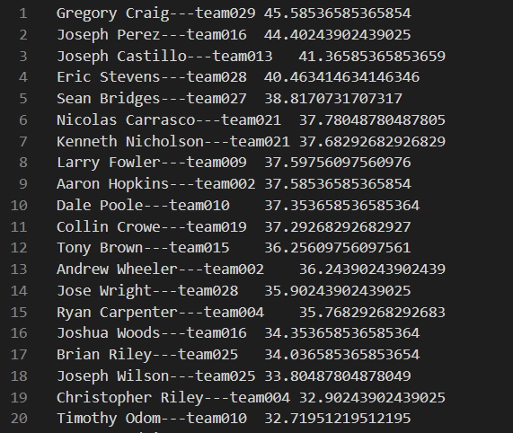

### 5.WebUI执行记录

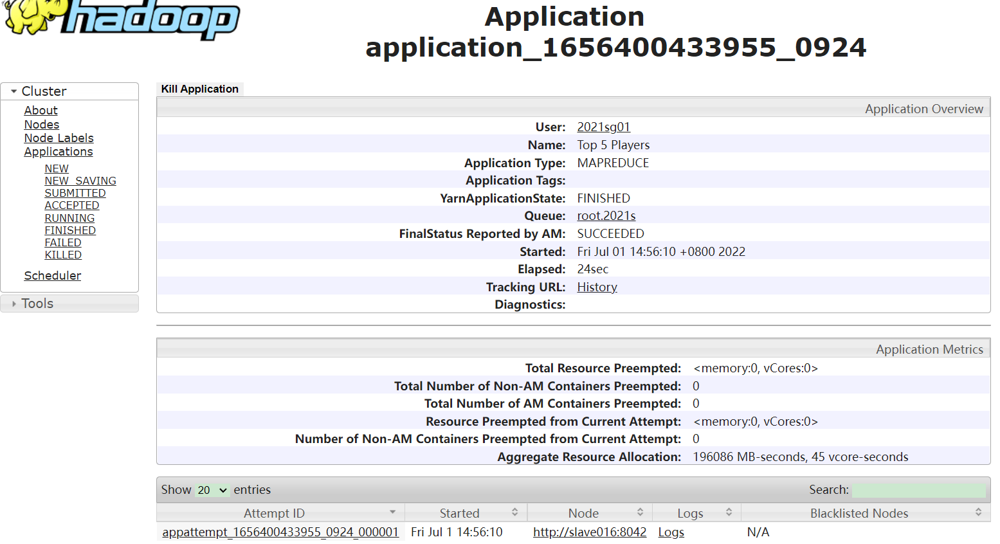

### 6.代码展示

#### 第一个Job的Map阶段

```java
public class MyMapper extends Mapper<Object, Text, Text,Text> {


    @Override
    protected void map(Object key, Text value, Context context) throws IOException, InterruptedException {
        
        if(key.toString().equals("0")){ //文件第一行,不处理
            return;
        }

        Event event=new Event(value);
        String outputKey=event.get("PlayBy");
        int score;
        
        
        if(event.get("ShotOutcome").equals("make")){ //投篮得分
            outputKey=String.join("#",outputKey,event.get("Shooter"));
            score= (event.get("ShotType").equals("2-pt")) ? 2:3 ; //两分球得2分，三分球得三分
            
            //助攻
            if(!event.get("Assister").isEmpty()){
                context.write(new Text(outputKey),new Text(Integer.toString(score)));
                outputKey=String.join("#"
                    ,event.get("PlayBy")
                    ,event.get("Assister"));
                score=1;
            }
        }
        else if(event.get("ShotOutcome").equals("miss")){ //错失投篮
            outputKey=String.join("#",outputKey,event.get("Shooter"));
            score=-1;
            //盖帽
            if(!event.get("Blocker").isEmpty()){
                context.write(new Text(outputKey),new Text(Integer.toString(score)));
                outputKey=String.join("#"
                    ,event.get("PlayBy").equals(event.get("HomeTeam")) ? event.get("AwayTeam") : event.get("HomeTeam")
                    ,event.get("Blocker"));
                score=1;
            }
        }
        else if ...... //其他事件
        else if......
        ......
        else return;

        //Emit
        context.write(new Text(outputKey),new Text(Integer.toString(score)));
        System.out.println(outputKey);
    }
}

```

#### 第一个Job的Reduce阶段

```java
public class MyReducer extends Reducer<Text,Text,Text, Text>{
    private HashMap<String, Integer> records = new HashMap<String, Integer>();

    @Override
    protected void setup(Reducer<Text, Text, Text, Text>.Context context) throws IOException, InterruptedException {
        //依次读取Distributed Cache中每一场比赛结果
        try{
            Path path=new Path(context.getCacheFiles()[0].getPath());
            FileSystem fs=FileSystem.get(context.getConfiguration());
            FSDataInputStream fis = fs.open(path);

            String line,winTeam,loseTeam;
            String[] tokens;
            BufferedReader joinReader=new BufferedReader(
                                        new InputStreamReader(fis, "UTF-8"));
            try {
                while ((line = joinReader.readLine()) != null) {
                    tokens = line.split(",", 5);
                    if(Integer.parseInt(tokens[2])>Integer.parseInt(tokens[4])){
                        winTeam=tokens[1]+"Win";
                        loseTeam=tokens[3]+"Lose";
                    }
                    else{
                        winTeam=tokens[3]+"Win";
                        loseTeam=tokens[1]+"Lose";
                    }
                    if(records.containsKey(winTeam)){
                        records.put(winTeam, records.get(winTeam)+1);
                    }
                    else{
                        records.put(winTeam, 1);
                    }
                    if(records.containsKey(loseTeam)){
                        records.put(loseTeam,records.get(loseTeam)+1);
                    }
                    else{
                        records.put(loseTeam,1);
                    }
                }
            } finally {
                joinReader.close();
            }
        }
        catch (IOException e)
        {
            System.err.println("Exception reading :"+e);
        }
    }
    @Override
    protected void reduce(Text key, Iterable<Text> values, Context context)  throws IOException, InterruptedException{
        String[] tokens=key.toString().split("#",2);
        String team=tokens[0],player=tokens[1];
        
        int score=0;

        for(Text value:values){
            score+=Integer.parseInt(value.toString());
        }
        int win=records.containsKey(team+"Win")?records.get(team+"Win"):0;
        int lose=records.containsKey(team+"Lose")?records.get(team+"Lose"):0;
        Double efficiency=new Double(score)/(win+lose);
        Double winRate=new Double(win)/(win+lose);          //胜率

        context.write(new Text(Double.toString(efficiency+winRate*20)),new Text(player+"---"+team));
    }
}
```

#### 第二个Job的Map和Reduce阶段

过于简单，Mapper即为Identity Mapper，Reducer将Key和Value调换即可。故不在此展示。

#### main函数部分

```java
public static void main(String[] args) throws Exception{
        //args: 命令行参数，分别为:
        //0:Job1输入数据集路径
        //1:Job1输出路径
        //2:Job2输出路径
        //3:Task 1输出的结果文件(放入distributed cache中)
        //4:Partition File保存路径

            //Job1：计算分数
                Configuration conf=new Configuration();
                
                Job job = Job.getInstance(conf,"Top 5 Players");

                job.setJarByClass(MyMain.class);
                job.setMapperClass(MyMapper.class);
                job.setReducerClass(MyReducer.class);

                job.setOutputKeyClass(Text.class);
                job.setOutputValueClass(Text.class);

                FileInputFormat.addInputPath(job, new Path(args[0]));//输入数据集的路径
                job.addCacheFile(new Path(args[3]).toUri()); //distributed cache
                FileOutputFormat.setOutputPath(job,new Path(args[1]));//输出路径

                job.waitForCompletion(true); //执行MapReduce Job，等待结束


            //Job2:全局排序
                conf = new Configuration();
                //设置分区的排序策略，全局有序,而非每个分区内有序
                conf.set("mapreduce.totalorderpartitioner.naturalorder", "false");
                
                job = Job.getInstance(conf,"Global Sort");
                job.setJarByClass(MyMain.class);
                
                job.setMapperClass(GlobalSortMapper.class);
                job.setReducerClass(GlobalSortReducer.class);
                job.setPartitionerClass(TotalOrderPartitioner.class);
                job.setSortComparatorClass(KeyComparator.class);
    
                job.setInputFormatClass(KeyValueTextInputFormat.class);
                job.setOutputKeyClass(Text.class);
                job.setOutputValueClass(Text.class); 
     
                FileInputFormat.addInputPath(job, new Path(args[1]));//Job1输出路径
                FileOutputFormat.setOutputPath(job, new Path(args[2]));//Job2输出路径
                
                TotalOrderPartitioner.setPartitionFile(conf, new Path(args[4]));
                InputSampler.Sampler<Text,Text> sampler=new InputSampler.RandomSampler<>(0.01,1000,10);
                InputSampler.writePartitionFile(job, sampler);
    
                job.waitForCompletion(true); //执行MapReduce Job，等待结束        
    }
```

## Task5：分析 team025 和 team028 的比赛特点（选做）

### 1.任务内容

分析team025 和 team028 的比赛特点。

根据分析出的比赛特点，从其中一队教练的角度出发，尝试提出对抗另一只球队的策略。

### 2.思路

我们先从以下几个方面对team025 和 team028 的比赛特点进行统计：

- 各个球员的效率值排名

- 各个球员的场均数据
- 各节偏好的出场球员
- 三分球、两分球的出手数偏好、得分偏好，以及各个球员的贡献 

- 关键球(第四节最后五分钟和加时赛)由谁出手

利用上述统计结果，对队伍的比赛特点进行分析，并提出对抗策略。

### 3.各个任务的结果

两个队内球员的效率值排名：

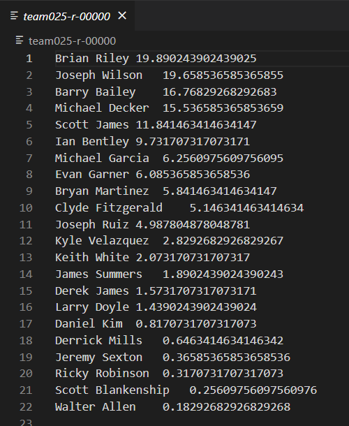 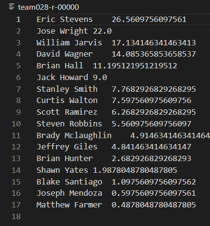

各个球员的场均数据：

- team025：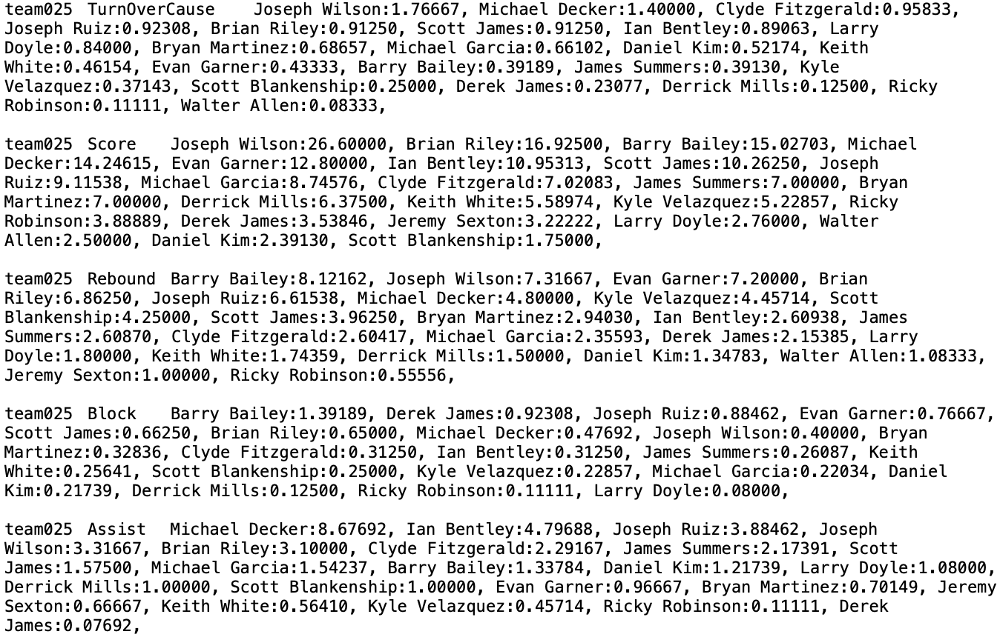

- team028：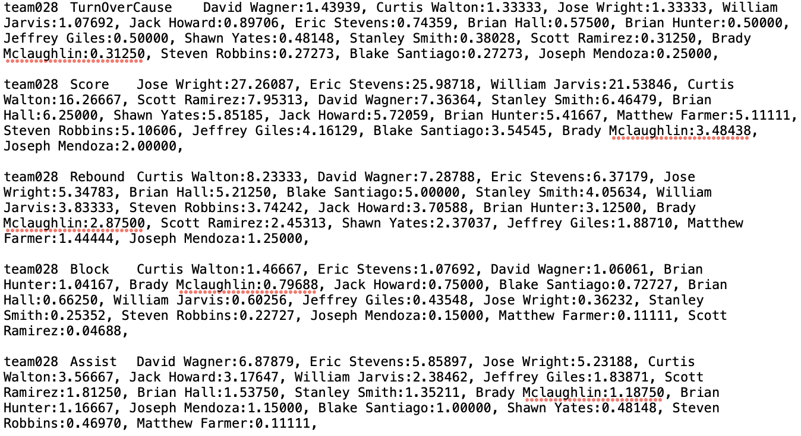

各节偏好的出场球员(每一节各个球员出场总次数)：

- team025：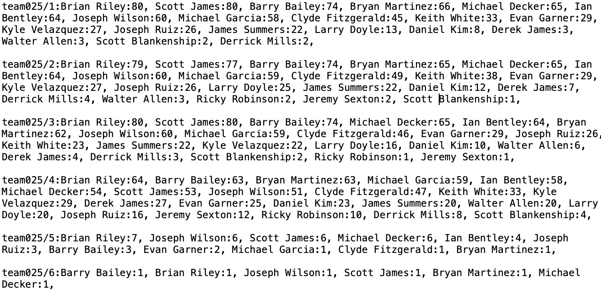

- team028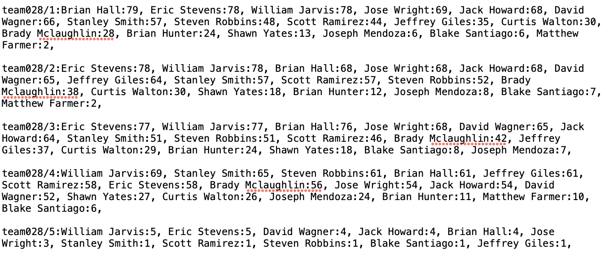

三分球、两分球的出手数偏好、得分偏好，以及各个球员的贡献 ：

- team025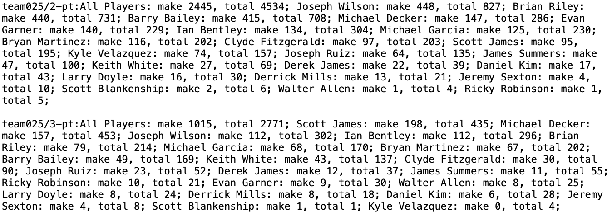

- team028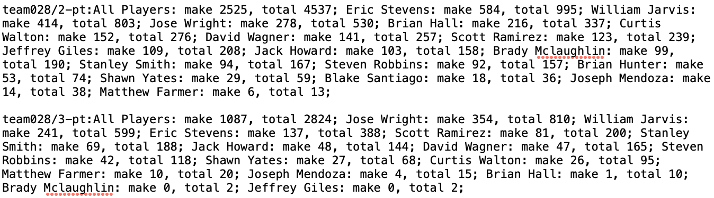

关键时刻两分球、三分球的总得分次数、投篮数，以及各个球员的贡献如下 :

- team025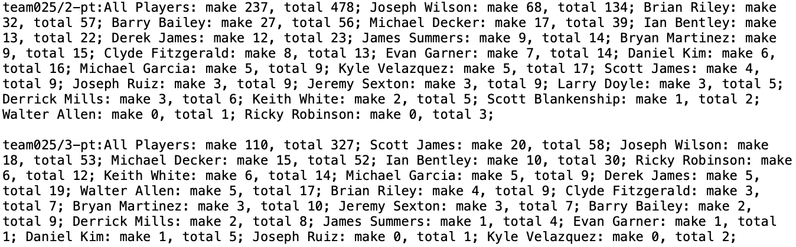
- team028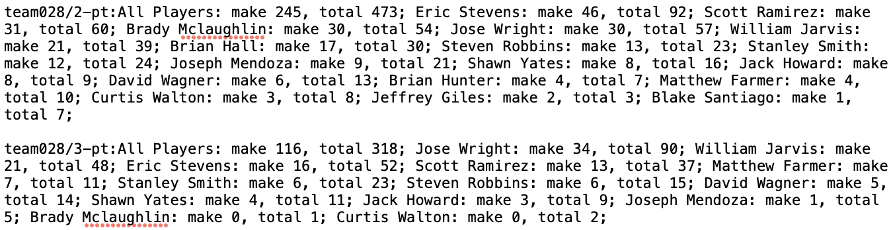


### 4.对球队比赛特点的分析、对抗另一只球队的策略

- team025：
  - Joseph Wilson的场均得分最高，远高于其他球员，是队内的**核心得分手**，效率值也排名队内第二。同时，球队**关键时刻**的投篮也大部分交由他出手。
  - 除了头号球员Joseph Wilson，其他球员的场均得分分布比较**均匀**，多名球员得分在7—15分。
  - Brian Riley是队内**二号得分手、队内篮板和盖帽最高者**，也是队内效率值第一名。是一名优质的二当家，也是球队**内线核心**。
  - 球队两分球出手数远高于三分球，以**两分球为主要得分手段**，但到了**关键时刻**，三分球出手**比例增加**。
  - 每个球员在各节的出场次数分布均匀，无明显偏好。
- team028：
  - Jose Wright，Eric Stevens，William Jarvis三名球员的得分都在**25分**以上，效率值也位列队内前三。是队内的**绝对核心**。
  - 除去上面三位球员，还有一名球员场均得到16分，其他球员的得分均在**8分以下**。
  - 综合以上两点，可以看出该队是典型的**三巨头球队**，三位核心球员能力极强，但其余角色球员能力较差。
  - 球队两分球出手数远高于三分球，以**两分球为主要得分手段**，但到了**关键时刻**，三分球出手**比例增加**。
  - 每个球员在各节的出场次数分布均匀，无明显偏好。

站在team028的教练的角度，对抗team025，有如下策略：

- 重点防守对方唯一的核心得分手Joseph Wilson，限制他的得分
- 充分发挥本队拥有**三名能力突出的核心球员**的优势，当对方核心Joseph Wilson下场休息时，安排一名或两名巨头在场，以保持绝对优势
- 更多收缩内线防守，限制对方的两分球出手；但关键时刻需要适当增加对三分球的防守布置。

### 5.各个子任务的具体实现

#### (1)各个球员的效率值排名

我们只需对任务四中计算效率值的代码稍加改动，分别对team025和team028的球员计算**效率值**，进行**队内**排名，每个队的排名输出到不同文件中。

与任务四的代码只有以下三点区别：

- 只针对team025和team028的球员进行统计
- 只计算效率值即可。
- 进行排序后，使用**MultipleOutputs**将两个队的对内效率值统计排名**划分到多个输出文件**中（以队名命名）。

其他思路与任务四完全相同，故不在此赘述。

#### (2)各个球员的场均数据

使用两组Mapper-Reducer来完成本次任务。

第一组Mapper-Reducer：Mapper读入数据，并且输出对应事件的球员、队伍、具体事件和日期(<Player, Team>, <Event, Date>)。对于得分，如果Shoot或者FreeThrow成功，输出对应的分数((<Player, Team>, <Score, Date>)。由于一个队伍一天只有一场比赛，所以不重复的日期数也即场次数。在Reducer中，利用Set去重计算当前球员的场次数。同时计算得到每个球员不同事件的数目。最后，输出球员的场均数据(Player, <Event, Average Count>)。由于数据中很多球员会在某一项或几项事件中计数为0，故只输出场均数据大于0的结果。

这一组Mapper和Reducer的简化版本代码如下：

```java
public class Mapper1 extends Mapper<Object, Text, Text, Text> {
    public void map(Object key, Text value, Context context) throws IOException, InterruptedException {
        StringTokenizer itr = new StringTokenizer(value.toString(), "\n");//读取行
        while (itr.hasMoreTokens()) {
            Event event = new Event(itr.nextToken());
            if (event.get("Assister").equals("Assister"))//表头
                continue;
            if (!(team1.equals("team025") || team1.equals("team028") ||
                    team2.equals("team025") || team2.equals("team028")))//去掉其他队伍
                continue;
          	......//get team1, team2, playby and date
            if (!event.get("Assister").equals("") && (playby.equals("team025") || playby.equals("team028"))) {
                context.write(new Text(event.get("Assister") + "/" + playby), new Text("Assist" + ":" + date));
            }
          	......//emit Blocker, Rebounder, TurnoverCauser and Score
        }
    }
}

public class Reducer1 extends Reducer<Text, Text, Text, Text> {
    public void reduce(Text key, Iterable<Text> values, Context context) throws IOException, InterruptedException {
        Iterator<Text> it = values.iterator();
        Text name = new Text(key);
        double Assist = 0, Block = 0, TurnOverCause = 0, Rebound = 0, Score = 0;
        Set<String> Dates = new HashSet<>();
        for(;it.hasNext();) {
            ......//get type and data
            Dates.add(date);
            if (type.equals("Assist")) {
                Assist += 1;
            }
            else ......//calculate Score, Rebound, TurnoverCause and Block
        }
        int MatchNum = Dates.size();//number of matches
        if (Score > 0)
            context.write(name, new Text("Score:" + (Score / MatchNum)));
        ......//emit Assist, Rebound, TurnoverCause and Block if they > 0
    }
}
```

第二组Mapper-Reducer：Mapper读入数据，并且根据事件，输出对应事件的球员和计数(<Event, Count>, Player)。为了让同一个Event的键值对进入同一个Reducer，需要自定义Partitioner；为了利用MapReduce框架的Sort根据Count对传入Reducer的键值对进行排序，需要自定义Comparator。便于Comparator进行比较，自定义了class TypeScore作为Mapper输出的key的类型。这样，就可以避免在Reducer中进行排序而造成的内存开销过大的问题。在Reducer中，将传入的当前Event得分前五的球员信息直接输出即可(Event, <Player, Count>)。

这一组Mapper和Reducer的简化版本代码如下：（Partitioner和Comparator的代码见代码文件夹）

```java
public class TypeScore implements WritableComparable<TypeScore>{
    private String type;
    private int score;
    public TypeScore(String type, int score) {
          this.type = type;//the type of event
          this.score = score;//the count of event
      }
   	......//functions
}

public class Mapper2 extends Mapper<Object, Text, TypeScore, Text> {
    public void map(Object key, Text value, Context context) throws IOException, InterruptedException {
        StringTokenizer itr = new StringTokenizer(value.toString(), "\n");//读取行
        while (itr.hasMoreTokens()) {
          	......//get name, type and score
            if (type.equals("Assist"))
                context.write(new TypeScore("Assist", score), new Text(name));
            else if (type.equals("TurnOverCause"))
                context.write(new TypeScore("TurnOverCause", score), new Text(name));
            else ......//output Block, Rebound and Score
        }
    }
}

public class Reducer2 extends Reducer<TypeScore, Text, Text, Text> {
    Integer i = 0;
    String cur_type = new String();
    public void reduce(TypeScore key, Iterable<Text> values, Context context) throws IOException, InterruptedException {
        Iterator<Text> it = values.iterator();
        int score = key.getScore();
        String type = key.getType();
        if((cur_type.equals("")) || (!cur_type.equals(type))) {//this type finishes
            cur_type = type;
            i = 0;
        }
        for (; (it.hasNext()) && (i < 5); i++) {//output the top 5 players
            String name = it.next().toString();
            context.write(new Text(type), new Text(name + ": " + score));
        }
    }
}
```

##### 优化工作

按照普通算法，在第二组Mapper-Reducer中，每个Event对应一个Reducer，在Reducer中根据Count从大到小进行排序，输出数量前五的选手信息。但是由于Reducer的这一步排序在内存中进行，当数据量较大时，可能发生内存泄漏。

因此，我们自定义Comparator，利用MapReduce框架的自动排序，对Mapper输出的键值对根据Count降序排列。为了便于Comparator的书写，我们自定义了class TypeScore作为Mapper输出的key的类型。这样，可以避免在Reducer中进行排序而引起的较大内存压力。

除此之外，由于只关注两个队伍的数据，因此数据集中大量数据实际上都不需要使用。在第一组Mapper-Reducer中，如果我们在Reducer中再进行筛选，会造成极大的资源浪费。因此，我们在Mapper中就进行筛选，只发送这两个队伍相关的数据给Reducer，减少了资源浪费。2

#### (3)各节偏好的出场球员

使用两组Mapper-Reducer来完成本次任务。

第一组Mapper-Reducer：Mapper读入数据，并且根据每一行，输出对应的球员、队伍、节和日期(<Player, Team>, <Date, Quarter>)。由于一个队伍一天只有一场比赛，所以不重复的日期数也即场次数。在Reducer中，利用Set去重计算当前球员在每一节的场次数。最后，输出球员各节的场次总数(<Player, Team>, <Period, Count>)。

这一组Mapper和Reducer的简化版本代码如下：

```java
public class Mapper1 extends Mapper<Object, Text, Text, Text> {
    public void map(Object key, Text value, Context context) throws IOException, InterruptedException {
        StringTokenizer itr = new StringTokenizer(value.toString(), "\n");//读取行
        while (itr.hasMoreTokens()) {
            Event event = new Event(itr.nextToken());
            if (event.get("Assister").equals("Assister"))//表头
                continue;
            if (!(team1.equals("team025") || team1.equals("team028") ||
                    team2.equals("team025") || team2.equals("team028")))//去掉其他队伍
                continue;
          	......//get team1, team2, playby, quarter and date
             if (!event.get("Assister").equals("") && (playby.equals("team025") || playby.equals("team028"))) {
                context.write(new Text(playby + "/" + event.get("Assister")), new Text(date + ":" + quarter));
            }
          	......//emit other mentioned players, including Blocker, Rebounder, TurnoverCauser and Score, etc.
        }
    }
}

public class Reducer1 extends Reducer<Text, Text, Text, Text> {
    public void reduce(Text key, Iterable<Text> values, Context context) throws IOException, InterruptedException {
        Iterator<Text> it = values.iterator();
        Text name = new Text(key);
        Set<String> Periods = new HashSet<>();//store unique matches
        HashMap<String, Integer> PeriodMap = new HashMap<>();//store the count for each period
        for (; (it.hasNext());) {
            String item = it.next().toString();
            Periods.add(item);
        }
        for (String pd : Periods) {//get the total count for each period
            String period = pd.split(":")[1];
            if (PeriodMap.containsKey(period)) {
                int cur = PeriodMap.get(period);
                PeriodMap.put(period, cur + 1);
            }
            else
                PeriodMap.put(period, 1);
        }
        for (String k : PeriodMap.keySet()) {
            context.write(name, new Text(k + "/" + PeriodMap.get(k)));//name + team, period + times
        }
    }
}
```

第二组Mapper-Reducer：Mapper读入数据，并且根据队伍，输出对应节的每个球员球员出现的次数(<Team, Period>, <Player, Count>)。在Reducer中，将传入的当前队伍对应节的各个球员按照出现次数从高到低排序输出( <Team, Period>， [<Player1, Count1>, <Player2, Count2>, ......])。

这一组Mapper和Reducer的简化版本代码如下：

```java
public class Mapper2 extends Mapper<Object, Text, Text, Text> {
    public void map(Object key, Text value, Context context) throws IOException, InterruptedException {
        StringTokenizer itr = new StringTokenizer(value.toString(), "\n");//读取行
        while (itr.hasMoreTokens()) {
            ......//get team, period, name and times (i.e., count)
            context.write(new Text(team + "/" + period),
                    new Text(name + "/" + times));//队伍+节，名字+次数
        }
    }
}

public class Reducer2 extends Reducer<Text, Text, Text, Text> {
    public void reduce(Text key, Iterable<Text> values, Context context) throws IOException, InterruptedException {
        Iterator<Text> it = values.iterator();
        String cur_period = key.toString();
        HashMap<String, Integer> PeriodMap = new HashMap<>();//store the count for each player and period
        for (; (it.hasNext());) {
          	......//get name and times (i.e., count)
            PeriodMap.put(name, times);
        }
        List<Map.Entry<String,Integer>> list = new ArrayList<Map.Entry<String,Integer>>(PeriodMap.entrySet());//sort the map
        Collections.sort(list, new Comparator<Map.Entry<String, Integer>>() {
            @Override
            public int compare(Entry<String, Integer> o1, Entry<String, Integer> o2) {
                return o2.getValue().compareTo(o1.getValue());
            }
        });
        ......//generate output list
        context.write(new Text(cur_period), new Text(output));
    }
}
```

##### 优化工作

由于只关注两个队伍的数据，因此数据集中大量数据实际上都不需要使用。在第一组Mapper-Reducer中，如果我们在Reducer中再进行筛选，会造成极大的资源浪费。因此，我们在Mapper中就进行筛选，只发送这两个队伍相关的数据给Reducer，减少了资源浪费。

#### (4)三分球 两分球 **出手**偏好 

使用两组Mapper-Reducer来完成本次任务。

第一组Mapper-Reducer：Mapper读入数据，并且根据每一行，输出对应的球员、队伍、投篮类型和结果(<Team, Player>, <ShotType, ShotOutcome>)。在Reducer中，汇总得到当前球员的两分球、三分球各自的得分次数和投篮次数，并输出(<Player, Team>, <ShotType, Success Count, Total Count>)。

这一组Mapper和Reducer的简化版本代码如下：

```java
public class Mapper1 extends Mapper<Object, Text, Text, Text> {
    public void map(Object key, Text value, Context context) throws IOException, InterruptedException {
        StringTokenizer itr = new StringTokenizer(value.toString(), "\n");//读取行
        while (itr.hasMoreTokens()) {
            Event event = new Event(itr.nextToken());
          	......//filter other teams
            if (!event.get("Shooter").equals("")) {
                String type = event.get("ShotType");
                String result = event.get("ShotOutcome");
                context.write(new Text(event.get("PlayBy") + "/" + event.get("Shooter")), new Text(type + "/" + result));
            }
        }
    }
}

public class Reducer1 extends Reducer<Text, Text, Text, Text> {
    public void reduce(Text key, Iterable<Text> values, Context context) throws IOException, InterruptedException {
        Iterator<Text> it = values.iterator();
        Text name = new Text(key);
        HashMap<String, Integer> SuccessMap = new HashMap<>();//store the success counts
        HashMap<String, Integer> TotalMap = new HashMap<>();//store the total counts
        for (; (it.hasNext());) {
            ......//get type and result
            ......//update SuccessMap and TotalMap
        }
        for (String k : TotalMap.keySet()) {//key is name of player
            if (SuccessMap.containsKey(k))
                context.write(name, new Text(k + "/" + SuccessMap.get(k) +
                        "/" + TotalMap.get(k)));
            else
                context.write(name, new Text(k + "/" + 0 +
                        "/" + TotalMap.get(k)));

        }
    }
```

第二组Mapper-Reducer：Mapper读入数据，并且根据队伍，以队伍和投篮类型为key，球员、得分次数和投篮次数为value发送键值对(<Team, ShotType>, <Player, Success Count, Total Count>)。在Reducer中，将传入的当前队伍对应投篮类型的总得分次数和总投篮次数输出。同时，也将各个球员按照得分次数从高到低排序输出( <Team, ShotType>， [<“All Players”, Success Count, Total Count>, <Player1, Success Count 1, Total Count1>, <Player2, Success Count 2, Total Count2>, ......])。

这一组Mapper和Reducer的简化版本代码如下：

```java
public class Mapper2 extends Mapper<Object, Text, Text, Text> {
    public void map(Object key, Text value, Context context) throws IOException, InterruptedException {
        StringTokenizer itr = new StringTokenizer(value.toString(), "\n");//读取行
        while (itr.hasMoreTokens()) {
        		......//get team, type, name, success count and total count
            context.write(new Text(team + "/" + type),
                    new Text(name + "/" + success + "/" + total));//队伍+得分类型，名字+次数
        }
    }
}

public class Reducer2 extends Reducer<Text, Text, Text, Text> {
    private class PersonalShoot {//for sorting the players
        Integer success;
        Integer total;
        PersonalShoot(){}
        PersonalShoot(int success, int total) {
            this.success = success;
            this.total = total;
        }
        public int getSuccess() {return this.success;}
        public int getTotal() {return this.total;}
    }
    public void reduce(Text key, Iterable<Text> values, Context context) throws IOException, InterruptedException {
        Iterator<Text> it = values.iterator();
        String team_type = key.toString();
        HashMap<String, PersonalShoot> ShootMap = new HashMap<>();//to store the success and total shot count for each player
        int all_success = 0, all_total = 0;
        for (; (it.hasNext());) {
            ......//get success count, total count and name
            all_success += success;
            all_total += total;
            PersonalShoot ps = new PersonalShoot(success, total);
            ShootMap.put(name, ps);
        }
        List<Map.Entry<String,PersonalShoot>> list = new ArrayList<>(ShootMap.entrySet());
        Collections.sort(list, new Comparator<Map.Entry<String, PersonalShoot>>() {
            @Override
            public int compare(Entry<String, PersonalShoot> o1, Entry<String, PersonalShoot> o2) {//sort the players
                if (o2.getValue().getSuccess() > o1.getValue().getSuccess())
                    return 1;
                else if (o2.getValue().getSuccess() < o1.getValue().getSuccess())
                    return -1;
                else
                    return 0;
            }
        });
        ......//prepare output list
        context.write(new Text(team_type), new Text(output));
    }
}
```

##### 优化工作

由于只关注两个队伍的数据，因此数据集中大量数据实际上都不需要使用。在第一组Mapper-Reducer中，如果我们在Reducer中再进行筛选，会造成极大的资源浪费。因此，我们在Mapper中就进行筛选，只发送这两个队伍相关的数据给Reducer，减少了资源浪费。

#### (5)关键球(最后时刻)由谁出手 

使用两组Mapper-Reducer来完成本次任务。

第一组Mapper-Reducer：Mapper读入数据，只针对第四节最后五分钟及加时赛的记录，根据每一行，输出对应的球员、队伍、投篮类型和结果(<Team, Player>, <ShotType, ShotOutcome>)。在Reducer中，汇总得到当前球员的两分球、三分球各自的得分次数和投篮次数，并输出(<Player, Team>, <ShotType, Success Count, Total Count>)。

这一组Mapper和Reducer的简化版本代码如下：

```java
public class Mapper1 extends Mapper<Object, Text, Text, Text> {
    public void map(Object key, Text value, Context context) throws IOException, InterruptedException {
        StringTokenizer itr = new StringTokenizer(value.toString(), "\n");//读取行
        while (itr.hasMoreTokens()) {
            Event event = new Event(itr.nextToken());
          	......//filter other teams and periods
            if (!event.get("Shooter").equals("")) {
                String type = event.get("ShotType");
                String result = event.get("ShotOutcome");
                context.write(new Text(event.get("PlayBy") + "/" + event.get("Shooter")), new Text(type + "/" + result));
            }
        }
    }
}

public class Reducer1 extends Reducer<Text, Text, Text, Text> {
    public void reduce(Text key, Iterable<Text> values, Context context) throws IOException, InterruptedException {
        Iterator<Text> it = values.iterator();
        Text name = new Text(key);
        HashMap<String, Integer> SuccessMap = new HashMap<>();//store the success counts
        HashMap<String, Integer> TotalMap = new HashMap<>();//store the total counts
        for (; (it.hasNext());) {
            ......//get type and result
            ......//update SuccessMap and TotalMap
        }
        for (String k : TotalMap.keySet()) {//key is name of player
            if (SuccessMap.containsKey(k))
                context.write(name, new Text(k + "/" + SuccessMap.get(k) +
                        "/" + TotalMap.get(k)));
            else
                context.write(name, new Text(k + "/" + 0 +
                        "/" + TotalMap.get(k)));
        }
    }
```

第二组Mapper-Reducer：Mapper读入数据，并且根据队伍，以队伍和投篮类型为key，球员、得分次数和投篮次数为value发送键值对(<Team, ShotType>, <Player, Success Count, Total Count>)。在Reducer中，将传入的当前队伍对应投篮类型的各个球员按照得分次数从高到低排序输出( <Team, ShotType>， [<Player1, Success Count 1, Total Count1>, <Player2, Success Count 2, Total Count2>, ......])。

这一组Mapper和Reducer的简化版本代码如下：

```java
public class Mapper2 extends Mapper<Object, Text, Text, Text> {
    public void map(Object key, Text value, Context context) throws IOException, InterruptedException {
        StringTokenizer itr = new StringTokenizer(value.toString(), "\n");//读取行
        while (itr.hasMoreTokens()) {
        		......//get team, type, name, success count and total count
            context.write(new Text(team + "/" + type),
                    new Text(name + "/" + success + "/" + total));//队伍+得分类型，名字+次数
        }
    }
}

public class Reducer2 extends Reducer<Text, Text, Text, Text> {
    private class PersonalShoot {//for sorting the players
        Integer success;
        Integer total;
        PersonalShoot(){}
        PersonalShoot(int success, int total) {
            this.success = success;
            this.total = total;
        }
        public int getSuccess() {return this.success;}
        public int getTotal() {return this.total;}
    }
    public void reduce(Text key, Iterable<Text> values, Context context) throws IOException, InterruptedException {
        Iterator<Text> it = values.iterator();
        String team_type = key.toString();
        HashMap<String, PersonalShoot> ShootMap = new HashMap<>();//to store the success and total shot count for each player
        int all_success = 0, all_total = 0;
        for (; (it.hasNext());) {
            ......//get success count, total count and name
            all_success += success;
            all_total += total;
            PersonalShoot ps = new PersonalShoot(success, total);
            ShootMap.put(name, ps);
        }
        List<Map.Entry<String,PersonalShoot>> list = new ArrayList<>(ShootMap.entrySet());
        Collections.sort(list, new Comparator<Map.Entry<String, PersonalShoot>>() {
            @Override
            public int compare(Entry<String, PersonalShoot> o1, Entry<String, PersonalShoot> o2) {//sort the players
                if (o2.getValue().getSuccess() > o1.getValue().getSuccess())
                    return 1;
                else if (o2.getValue().getSuccess() < o1.getValue().getSuccess())
                    return -1;
                else
                    return 0;
            }
        });
        ......//prepare output list
        context.write(new Text(team_type), new Text(output));
    }
}
```

##### 优化工作

由于只关注两个队伍的数据，因此数据集中大量数据实际上都不需要使用。在第一组Mapper-Reducer中，如果我们在Reducer中再进行筛选，会造成极大的资源浪费。因此，我们在Mapper中就进行筛选，只发送这两个队伍相关的数据给Reducer，减少了资源浪费。

### 6.WebUI执行结果

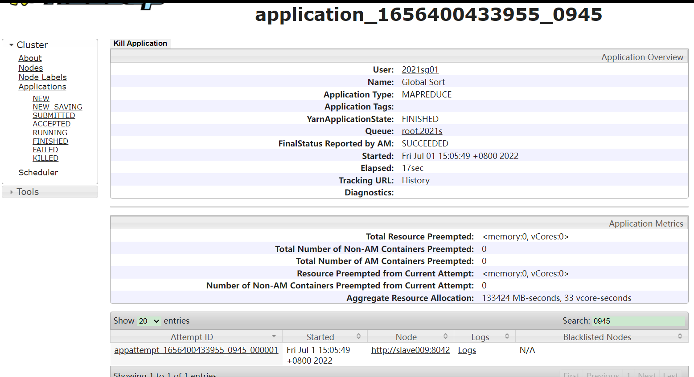

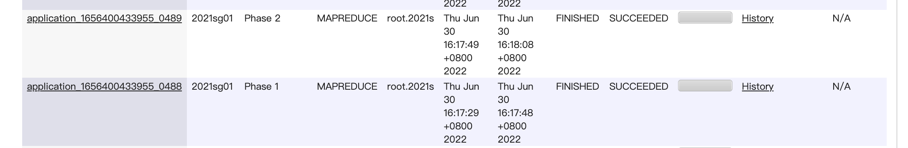


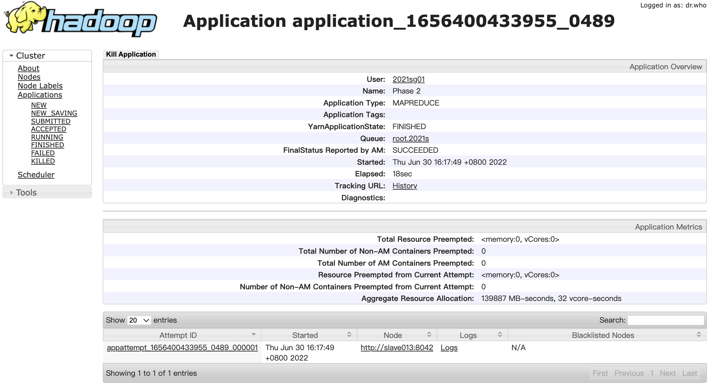

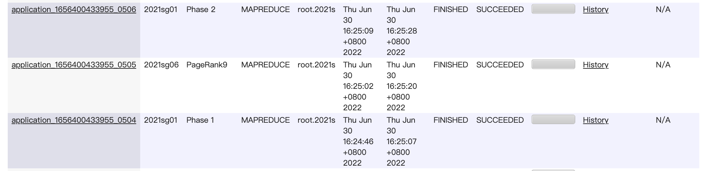

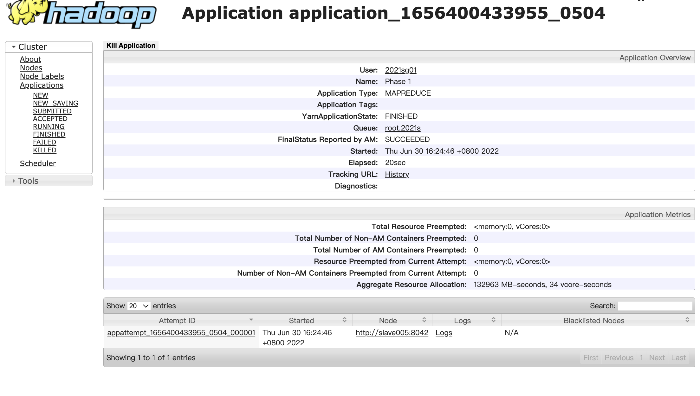

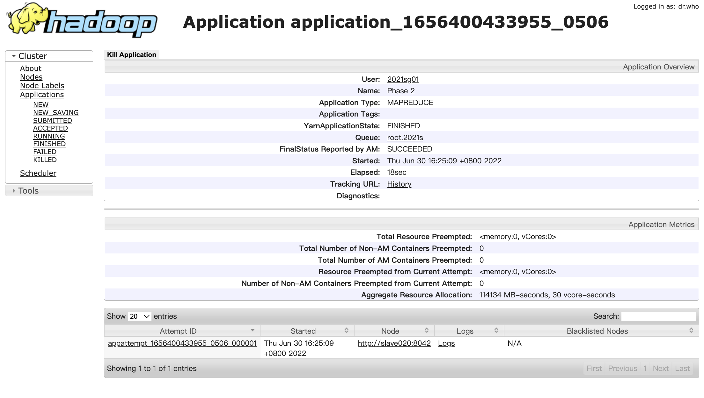

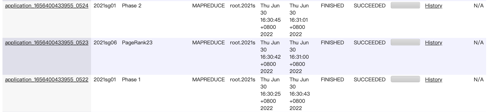


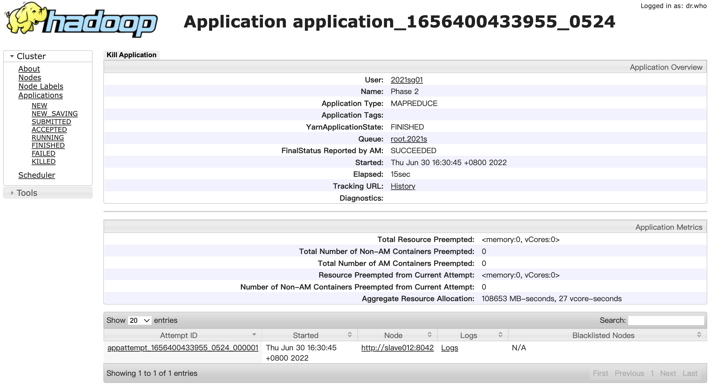

